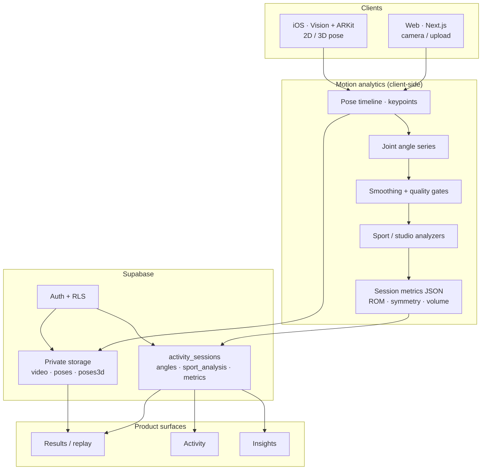

# Mova Atlética

**Movement visualization for trainers and athletes** — capture, analyze, and understand form on **web** and **iOS**, with private Activity history and descriptive Insights.

> **Portfolio case study (design, architecture, data story, mockups):**  
> **[treybradley.xyz/mova-atletica](https://www.treybradley.xyz/mova-atletica)**  
>
> **Live product:** [app.mova-atletica.xyz](https://app.mova-atletica.xyz) · [App Store](https://apps.apple.com/us/app/mova-atletica/id6775322595)

_Solo-built: product design, design engineering (Next.js), motion analytics pipeline, Supabase, Stripe + Apple billing, and GTM tooling._

GitHub does not render iframes in READMEs — use the portfolio link above for the full narrative, diagrams, and UI gallery.

---

## What ships today

| Surface | What it does |
|--------|----------------|
| **Sport tools + Motion Studio** | Plank, squat, pull-ups, push-ups, and open-clip analysis (record or upload) on web and iOS |
| **Results / replay** | Overlays, joint angle charts, sport-aware metrics, session replay |
| **Account · Activity** | Private session list, volume, filters |
| **Account · Insights** | Sport + time-range summaries, trends (descriptive metrics — not medical diagnosis) |
| **Pro** | Stripe (web) and App Store (iOS); video storage and full Studio exports where entitled |

iOS uses **Vision** (2D) and **ARKit** (3D) on device; web uses browser pose detection. Both write into the **same Supabase session model**.

---

## System architecture



**Stack (high level)**

| Layer | Technology |
|-------|------------|
| Web app | Next.js 15, React, TypeScript, Tailwind CSS |
| UI primitives | Radix UI, Recharts (account charts) |
| Pose (web) | TensorFlow.js / pose-detection (legacy paths + studio flows) |
| Data & auth | Supabase (Postgres, Auth, Storage, RLS) |
| Billing | Stripe (web Pro), Apple App Store Server Library (iOS) |
| i18n | en, es, pt-BR message catalogs |
| Content / GTM | Remotion reels (`reels/`) |
| Optional legacy | Python FastAPI backend (`backend/`) for advanced offline analysis; Prisma/SQLite exercise library paths remain in repo for older tooling |

---

## Data pipeline (descriptive motion analytics)

End-to-end flow aligned with production Account surfaces:

1. **Capture** — Video or live camera → per-frame keypoints (web) or Vision/ARKit streams (iOS).
2. **Angle series** — `OpenMoveAngleSeries` joint timelines (knee, hip, elbow, shoulder, spine).
3. **Smoothing** — `src/lib/angleSeriesSmoothing.ts` (display preset applied before measurement).
4. **Quality gates** — `src/lib/sessionMovementMetrics.ts`: minimum tracked samples, minimum ROM, left/right coverage before symmetry scores (avoids scoring occluded or one-sided clips).
5. **Session metrics** — Peak ROM per joint, optional symmetry, aggregated into `SessionMovementMetrics` stored in `activity_sessions.metrics` (JSONB).
6. **Sport analysis** — Reps, hold, duration, and sport-specific payloads under `src/lib/sportAnalysis/`.
7. **Account aggregation** — `src/lib/accountActivityInsights.ts` → Activity list + Insights (range totals, takeaways, trend charts).

**Principles**

- **Collect carefully** — On-device pose where possible; cloud rows and storage scoped to the signed-in user (RLS).
- **Process honestly** — Prefer missing metrics over fake precision when tracking is weak.
- **Insight, not diagnosis** — Volume and motion trends for coaching and self-guided practice; complements professional care, does not replace it.

Key types: `src/types/accountActivity.ts` · persistence: `src/lib/activitySessions.ts` · migrations: `supabase/migrations/`.

---

## Design system & component patterns

Built for fast iteration across web (and parity with native iOS UX):

| Concern | Where |
|---------|--------|
| **Design tokens** | `src/app/globals.css` — background, foreground, accent, card, buttons, light/dark |
| **Typography** | Roboto Mono via `src/app/layout.tsx` — scoreboard-style numerics (Insights, stats) |
| **Account UX** | `src/components/account/` — Activity, Insights (`SportSummaryCard`, charts), Pro block, i18n strings |
| **Shell / navigation** | `LibraryShell`, archive rail themes, homepage canvas |
| **Motion Studio** | `src/app/open-move-v2/` |
| **Shared controls** | `ChartTimeRangeToggle`, export panel selects, Radix-based dialogs |

Figma exploration, static prototypes, and visual system notes live on the **[portfolio case study](https://www.treybradley.xyz/mova-atletica)**.

---

## Repository map

```
src/
├── app/                    # Next.js App Router (home, account, open-move, coach, partner, API routes)
├── components/             # UI (account/, archive/, legal/, …)
├── lib/
│   ├── sessionMovementMetrics.ts   # ROM / symmetry derivation
│   ├── accountActivityInsights.ts  # Insights + sport range summaries
│   ├── activitySessions.ts         # Supabase session CRUD
│   ├── sportAnalysis/              # Per-sport logic
│   └── openMoveAngleSeries.ts      # Angle series model
├── i18n/messages/          # en.json, es.json, pt-BR.json
supabase/migrations/        # Schema, RLS, storage policies (see supabase/README.md)
reels/                      # Remotion product-in-use compositions
backend/                    # Optional Python analysis server (legacy/advanced)
```

---

## Local development

### Prerequisites

- Node.js 18+
- Supabase project (URL + anon key)
- Stripe test keys (optional, for Pro checkout locally)

### Install & run

```bash
git clone <repository-url>
cd mova-mvp-dev-01
npm install
npm run dev
```

Open [http://localhost:3000](http://localhost:3000).

### Environment

Create `.env.local` (do not commit secrets):

```env
NEXT_PUBLIC_SUPABASE_URL=
NEXT_PUBLIC_SUPABASE_ANON_KEY=
SUPABASE_SERVICE_ROLE_KEY=

STRIPE_SECRET_KEY=sk_test_...
STRIPE_PRICE_PRO_MONTHLY=price_...
STRIPE_PRICE_PRO_YEARLY=price_...
STRIPE_WEBHOOK_SECRET=whsec_...
NEXT_PUBLIC_SITE_URL=http://localhost:3000
```

**Stripe local:** `stripe listen --forward-to localhost:3000/api/stripe/webhook` and use the CLI signing secret for `STRIPE_WEBHOOK_SECRET`.

**Supabase:** Apply migrations in order — see [`supabase/README.md`](supabase/README.md). Run entitlement lock migration `20260731_profiles_entitlement_lock.sql` so client cannot self-grant Pro.

### Optional Python backend

For legacy/advanced analysis endpoints:

```bash
cd backend
python -m venv venv
source venv/bin/activate
pip install -r requirements.txt
python main.py
```

Set `NEXT_PUBLIC_PYTHON_BACKEND_URL=http://localhost:8000` if the frontend still calls those routes.

---

## License

MIT License — see repository license file if present.

## Support

Product and case-study context: **[treybradley.xyz/mova-atletica](https://www.treybradley.xyz/mova-atletica)**.  
For app support: support@mova-atletica.xyz (as listed on the marketing site).
