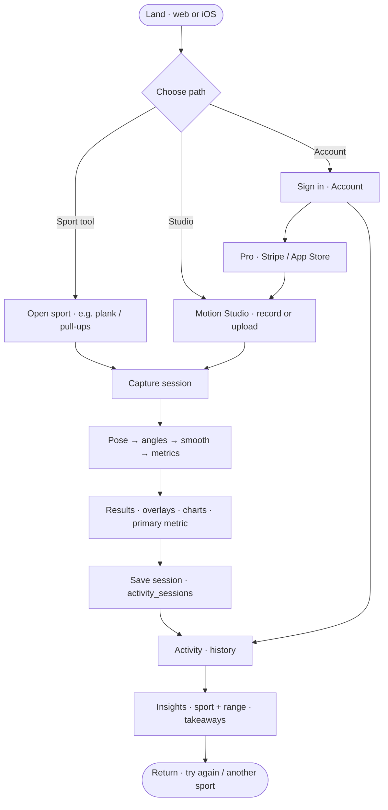
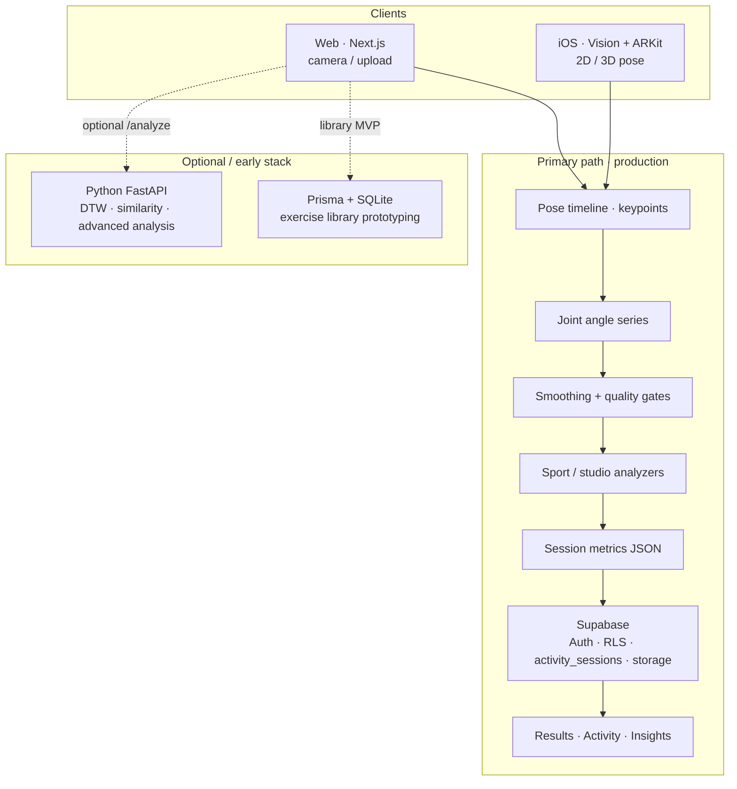
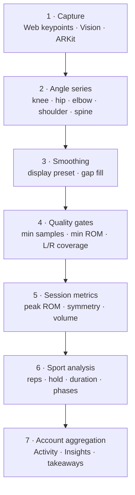
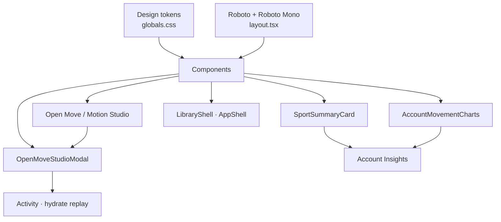

# Mova Atlética

**Movement visualization for trainers and athletes** — capture, analyze, and understand form on **web** and **iOS**, with private Activity history and descriptive Insights.

> **Portfolio case study (design, architecture, data story, mockups):**  
> **[treybradley.xyz/mova-atletica](https://www.treybradley.xyz/mova-atletica)**  
>
> **Live product:** [app.mova-atletica.xyz](https://app.mova-atletica.xyz) · [App Store](https://apps.apple.com/us/app/mova-atletica/id6775322595)

_Solo-built: product design, design engineering (Next.js), motion analytics pipeline, Supabase, Stripe + Apple billing, and GTM tooling._

GitHub does not render iframes in READMEs — use the portfolio link above for the full narrative, diagrams, and UI gallery.

---

## What ships today

| Surface | What it does |
|--------|----------------|
| **Sport tools + Motion Studio** | Plank, squat, pull-ups, push-ups, and open-clip analysis (record or upload) on web and iOS |
| **Results / replay** | Overlays, joint angle charts, sport-aware metrics, session replay |
| **Account · Activity** | Private session list, volume, filters |
| **Account · Insights** | Sport + time-range summaries, trends (descriptive metrics — not medical diagnosis) |
| **Pro** | Stripe (web) and App Store (iOS); video storage and full Studio exports where entitled |

iOS uses **Vision** (2D) and **ARKit** (3D) on device; web uses browser pose detection. Both write into the **same Supabase session model**.

---

## User flow



---

## System architecture



**Stack (high level)**

| Layer | Technology | Role |
|-------|------------|------|
| Web app | Next.js 15, React, TypeScript, Tailwind CSS | Consumer UI + Motion Studio |
| UI primitives | Radix UI, Recharts | Account charts, accessible controls |
| Pose (web) | TensorFlow.js / pose-detection | Browser keypoints |
| Pose (iOS) | Vision (2D), ARKit (3D) | On-device capture |
| **Data & auth (production)** | **Supabase** (Postgres, Auth, Storage, RLS) | Sessions, private media, entitlements |
| Billing | Stripe (web Pro), App Store Server API (iOS) | Pro unlock |
| i18n | en, es, pt-BR | Localized account / Insights copy |
| Content / GTM | Remotion (`reels/`) | Product-in-use content |
| **Optional · Python FastAPI** (`backend/`) | NumPy / SciPy / scikit-learn | Early advanced analysis — DTW, cosine similarity, rep tempo |
| **Optional · Prisma + SQLite** | Local exercise library | Initial library concept & local testing — not the live account store |

---

## Data pipeline (descriptive motion analytics)



End-to-end flow aligned with production Account surfaces:

1. **Capture** — Video or live camera → per-frame keypoints (web) or Vision/ARKit streams (iOS).
2. **Angle series** — `OpenMoveAngleSeries` joint timelines (knee, hip, elbow, shoulder, spine).
3. **Smoothing** — `src/lib/angleSeriesSmoothing.ts` (display preset applied before measurement).
4. **Quality gates** — `src/lib/sessionMovementMetrics.ts`: minimum tracked samples, minimum ROM, left/right coverage before symmetry scores (avoids scoring occluded or one-sided clips).
5. **Session metrics** — Peak ROM per joint, optional symmetry, aggregated into `SessionMovementMetrics` stored in `activity_sessions.metrics` (JSONB).
6. **Sport analysis** — Reps, hold, duration, and sport-specific payloads under `src/lib/sportAnalysis/`.
7. **Account aggregation** — `src/lib/accountActivityInsights.ts` → Activity list + Insights (range totals, takeaways, trend charts).

**Principles**

- **Collect carefully** — On-device pose where possible; cloud rows and storage scoped to the signed-in user (RLS).
- **Process honestly** — Prefer missing metrics over fake precision when tracking is weak.
- **Insight, not diagnosis** — Volume and motion trends for coaching and self-guided practice; complements professional care, does not replace it.

Key types: `src/types/accountActivity.ts` · persistence: `src/lib/activitySessions.ts` · migrations: `supabase/migrations/`.

---

## Design system & component patterns

Built for fast iteration across web (and parity with native iOS UX). Tokens live in CSS; components compose them with Tailwind + Radix.



### Color tokens

| Token | Example hex | Role |
|-------|-------------|------|
| `--background` | `#181a1a` | Page / onyx surface |
| `--foreground` | `#F3F3F4` / `#c0c9cc` | Primary text (theme-dependent) |
| `--card-bg` | `#f6f1e3` / `#353839` | Cards — parchment (light) / onyx (dark) |
| `--accent` | `#3b82f6` | Primary actions |
| `--muted` / muted labels | `#7d765f` / theme muted | Secondary copy, section labels |
| `--success` | `#64FF58` | Positive / chart accents |
| `--warning` / `--error` | `#ff8044` / `#FC7C7C` | Status |

Source: `src/app/globals.css` (core + `prefers-color-scheme: dark` overrides).

### Typography

| Family | CSS variable | Use |
|--------|--------------|-----|
| **Roboto** | `--font-roboto` | UI body / chrome |
| **Roboto Mono** | `--font-roboto-mono` | Scoreboards, Insights heroes, tabular metrics |

Loaded in `src/app/layout.tsx`. Scale patterns in product UI: large mono heroes (`text-5xl`), uppercase tracking labels (`text-[10px]`), takeaway body (`text-sm`).

### Component anatomy — Account Insights

```
SportSummaryCard
├── Header — Sport · range label
├── Left column (md+)
│   ├── VolumeSubCard — hero metric + best-session subline
│   └── SessionsSubCard — count + cadence / most recent
└── TakeawaysSubCard — bulleted descriptive insights

Supporting charts (side-by-side from lg)
├── SportTrendChart — primary volume over time
└── SportJointRomTrendChart — joint ROM over time

Shared controls: ChartTimeRangeToggle · sport tabs · scrub detail panels
Primitives: Radix (dialog, select, …) + tokenized Tailwind (`var(--card-bg)`, borders)
```

| Area | Location |
|------|----------|
| Account UX | `src/components/account/` |
| Shell / navigation | `LibraryShell`, archive rail, homepage canvas |
| Motion Studio | `src/app/open-move-v2/` · modal: `src/components/open-move/OpenMoveStudioModal.tsx` |
| i18n | `src/i18n/messages/{en,es,pt-BR}.json` |

**Figma (MA Beta Design System)**:
- **[As-built · Atlética section](https://www.figma.com/design/If7L5q9fnsivf9mkaiFH4n/MA-Beta-Design-System?node-id=6260-12328)** — tokens, SportTabChip, ChartTimeRangeToggle, SportSummaryCard, PrimaryButton
- **[Full screens · from live app](https://www.figma.com/design/If7L5q9fnsivf9mkaiFH4n/MA-Beta-Design-System?node-id=6266-66)** — html-to-design captures (Account, Insights, Studio modal, marketing/auth)

Portfolio narrative: **[treybradley.xyz/mova-atletica](https://www.treybradley.xyz/mova-atletica)**.

---

## License

MIT License — see repository license file if present.

## Support

Product and case-study context: **[treybradley.xyz/mova-atletica](https://www.treybradley.xyz/mova-atletica)**.  
For app support: support@mova-atletica.xyz (as listed on the marketing site).
