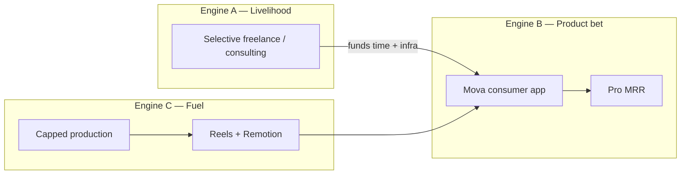
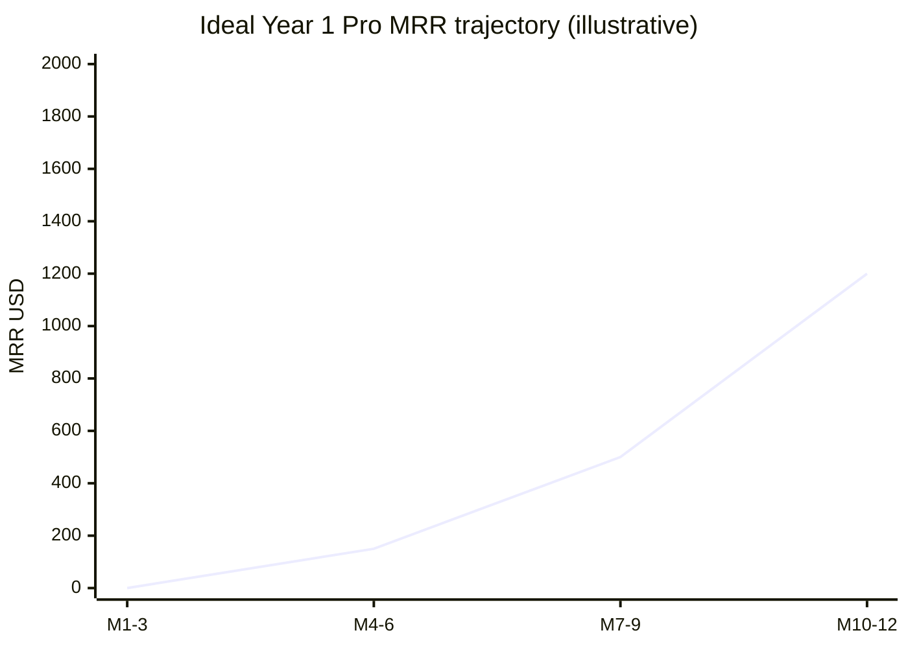

# Mova Atletica — Solo-Operator Business Plan

**Company:** Mova Atletica, Inc. (New York C-Corp)  
**Founder:** Gerald A. Bradley III (“Trey”) — sole builder and operator  
**Version:** Fall 2026 (revises Winter 2025 plan)  
**Status:** Living operating plan — not a fundraising pitch  

---

## 1. One-line position

Mova Atletica is a **founder-operated motion-analysis product** used to inch the founder’s career and company toward **product, data/tech, and consulting** — not toward more client creative-experiential hustle. Day-to-day cash may still come from selective freelance; the *company* bets on the consumer product, distribution, and higher-leverage advisory/tech work. No multi-sided marketplace or enterprise platform until product revenue or consulting repeats.

---

## 2. Career and company vector

### Direction (intentional)

| Toward | Away from |
|---|---|
| Product / tech ownership (Mova app) | Open-ended agency creative-tech retainers |
| Data science / motion analytics credibility | Pure “experiential installation” client delivery |
| Business + consulting (motion, product, CV) | Client hustle with late pay / scope chaos |
| Owned brand moments (if any experiential) | Building someone else’s event under burnout conditions |

### Lesson learned (studio / experiential)

- ~$15K motion-tracking / creative-tech work this year proved the craft sells — and that **client experiential is high-friction**.
- MATTE: engagement was notionally larger (~$30K) but pulled after difficult collaboration and late payment.
- Prior DE-YAN burnout reinforces: **do not rebuild a career on agency-style creative-tech delivery**.

### Creative-tech policy (this plan)

| Use | Allowed? | How |
|---|---|---|
| Client experiential / projection / installation gigs | **Default no** | Only if cash terms are prepaid / milestone-hard, short scope, and it advances product/data positioning — not “another hustle” |
| Creative tech as **marketing cost** for Mova | **Yes, capped** | e.g. owned set pieces (projection-mapped wall, motion content) used for video / brand — treat as GTM spend like the Jorge shoot |
| Creative tech **events / marketing owned by Mova** | **Maybe later** | Only if *you* own the IP, audience, and upside — not producing for a difficult third party |
| Parque | Internal tool | Not a sold product; may support owned demos |

---

## 3. What this is / is not

### What it is today

| Reality | Evidence |
|---|---|
| Solo-operator company | Founder is the only person who has built and shipped the stack |
| Live consumer product (Phase A) | Web (`app.mova-atletica.xyz`) + iOS App Store; Supabase auth; free sport mini-apps; Motion Studio; leaderboards; insights |
| Paid entitlement wired | Stripe Pro ($9/mo, $99/yr) + Apple IAP; tiers `free` / `pro` / `partner` |
| Content production system | Remotion reel compositor; organic social GTM |
| Craft proof (not the model) | ~$15K MATTE-related creative-tech revenue; contract stopped short of ~$30K |
| Legal shell | Terms, privacy, Mova Atletica, Inc. |

### What it is not (yet)

- A venture-scale multi-industry AI platform (fitness + healthcare + VR + robotics + defense)
- A trainer marketplace or UGC commerce business (Phase B intentionally off / mock)
- A motion-data licensing / dataset marketplace company
- A hired product, AI, sales, or content team
- An experiential / creative-tech agency
- Parque as a standalone revenue product

### Honest classification

| Lens | Verdict |
|---|---|
| **Portfolio / career asset** | Strong — live iOS + web CV product, billing, compositor; points at product/data/tech |
| **Business** | Emerging — needs *repeatable* Pro and/or consulting-shaped revenue |
| **Asset to sell** | Possible later; today value is IP + founder, not an exit story |

---

## 4. Relationship to the Winter 2025 plan

Kept: camera-only biomechanics, design as differentiation, lean ops, optional monetization paths.  

Dropped as near-term operating assumptions: parallel marketplace + enterprise + data licensing, hired teams, aggressive ARR ($3M Year 2).  

Empire ideas → **Appendix A — Upside only**.

---

## 5. Company engines (revised)

```text
Engine A — Livelihood (necessary, selective)
  Freelance / consulting that funds life and Mova
  Prefer: product, data, tech, advisory scopes
  Avoid: open-ended experiential client delivery

Engine B — Product (primary company bet)
  Free mini-apps → content → App Store / web → Pro
  Remotion reels as distribution
  Partner/Coach invite-only

Engine C — Content & owned brand moments (supporting)
  DIY + Remotion (default)
  Capped shoots (e.g. Jorge / Nov)
  Optional owned creative-tech as marketing cost — not client hustle
```



---

## 6. Offer stack

### 6.1 Selective livelihood work (not “Mova Studio agency”)

Accept work that:

- Pays on clear terms (deposit / milestones; no chronic late-pay clients)
- Builds **product, data, CV, or consulting** credentials
- Leaves energy for Engine B

Decline or hard-scope work that is:

- Experiential / installation / “creative tech for brands” with agency dynamics
- Open-ended hustle that crowds out the app

### 6.2 Consumer product (company bet)

| Tier | What they get |
|---|---|
| **Free** | Sport mini-apps (plank, squat, pull-ups, push-ups), analysis, leaderboards, watermarked export; metrics kept; video storage locked |
| **Pro ($9/mo or $99/yr)** | Motion Studio, full overlays, clean exports, video with sessions |
| **Partner / Coach** | Includes Pro + Coach Studio + partner tools (e.g. reel compositor); invite-only |

**Deferred:** Phase B programs commerce, creator browse, partner program marketplace (`PHASE_B_ENABLED`).

### 6.3 Content / owned moments (supporting spend)

- Organic reels for consumer GTM  
- Production: founder + Remotion; optional lightweight shoot team  
- Owned creative-tech (projection sets, etc.) only as **capped marketing** or future **owned** events — not client delivery  

---

## 7. Ideal Year 1 outcomes

Year 1 = **next 12 months** from this plan (Fall 2026 → Fall 2027).  
Targets are **solo-realistic ideals**, not Winter 2025 ARR fiction. “Ideal” = stretch that still fits ~6–12 hrs/week on Mova + livelihood work.

### 7.1 Scorecard (ideal)

| Domain | Ideal Year 1 outcome | Why it matters |
|---|---|---|
| **Product — distribution** | Consistent posting (≥1–2×/week most weeks); App Store as default CTA | Without this, Pro never gets a fair test |
| **Product — activation** | Measurable try-path: downloads / completed free analyses growing QoQ | Awareness without try = vanity |
| **Product — revenue** | **$500–2,000 MRR** Pro by month 12 *or* clear learning that pricing/positioning must change | Early business signal — not $3M ARR |
| **Product — retention** | A visible minority of Pros stay >1 billing cycle | Separates curiosity from value |
| **Career vector** | ≥1 paid engagement that is **product / data / consulting-shaped** (not experiential install) | Moves identity off creative-agency track |
| **Livelihood** | Income stable enough that Mova hours don’t collapse | Solo plan fails if burnout returns |
| **Content ops** | Remotion pipeline + ≥1 capped shoot (e.g. Nov) yielding weeks of plates | Removes talent drought as excuse |
| **Explicit non-goals** | No Phase B marketplace live; no dataset API store; no agency book of experiential clients | Protects focus |

### 7.2 Outcomes by confidence band

| Band | Product | Livelihood / career | Content |
|---|---|---|---|
| **Floor (must hit)** | Still shipping; posting most weeks; App Store CTA live; infra paid | Bills covered without toxic experiential clients | Oct consistency + Nov shoot decision made |
| **Ideal (aim here)** | $500–2k Pro MRR *or* documented why not + next experiment; QoQ activation up | ≥1 product/data/consulting-shaped paid win; MATTE-style deals filtered out | Steady Remotion cadence; plates for Q1 |
| **Stretch (nice)** | $2k+ MRR; Partner/Coach pilot paying or trading real audience | Recurring advisory / tech retainer (non-experiential) | Owned brand moment (capped) that feeds content |



*Chart is directional only — not a forecast. Floor can be $0 MRR if activation learning is honest; ideal band is early hundreds to low thousands by year end.*

### 7.3 Time allocation ideal (steady state)

| Bucket | Hours / week | Year 1 intent |
|---|---|---|
| Distribution (post, reply, CTA) | 3–4 | Non-negotiable |
| Product (activation / Pro / bugs) | 2–4 | Company bet |
| Livelihood BD / delivery | as needed for income | Prefer consulting/product scopes; cap experiential |
| Ops | ≤1 | Keep lights on |
| Creative-tech client work | **~0 default** | Only exceptions that pass §2 policy |

### 7.4 What “winning Year 1” looks like in one sentence

> Mova is clearly a **product** with early Pro signal (or a sharp lesson), the founder is known for **motion product/data/tech**, livelihood does not depend on toxic experiential clients, and content ops run without a full-time agency.

---

## 8. Product snapshot (as built)

### Live / Phase A

- Motion Studio (`/open-move-v2`) — record/upload, overlays, export  
- Quick analysis mini-apps — movements the app can score today  
- Account, insights, leaderboards, i18n (en / es / pt-BR)  
- Mobile web → App Store funnel; desktop for deeper Studio / Coach  
- Activity persistence (poses always; video Pro-only)  

### Built but not the operating focus

- Partner dashboard / program submit (mock `localStorage`)  
- Programs / creators / entitlements UI behind Phase B flag  
- Legacy exercise-library / Python advanced-analysis — only if product or consulting need pays for it  

### Content tooling

- Remotion `ProductInUse`: plate + overlays + charts + glass UI + export  
- Stretch limited talent into variants (reveal / metric / how-to / contrast)  

---

## 9. Go-to-market

### 9.1 Consumer GTM = content

Primary channel: Instagram / TikTok **product-in-use reels**.

Winning pattern: contrast hook → real athlete → overlay payoff → optional metric → CTA **free App Store app**.

No second parallel GTM (ads, enterprise outbound, dataset BD) in the same scarce hours.

### 9.2 Current content reality (Fall 2026)

| Period | Reality | Operating rule |
|---|---|---|
| **September** | Awareness content performed well (Raya-era) | Keep hooks; don’t recreate that budget weekly |
| **October** | Raya out; founder-only; Remotion; thin talent; posting consistency is the risk | 1–2 posts/week; remix plates; App Store CTA; schedule ahead |
| **November** | Jorge: lightweight team; models may trade for content; ~8–10K MXN; possible beach yoga gazebo | Cap spend; written releases; Remotion fuel; founder edits + posts |

### 9.3 Jorge / November shoot rules

1. All-in ~8–10K MXN unless consciously raised  
2. Written releases — Mova perpetual marketing use; talent gets selects/collabs, not joint ownership of Mova edits  
3. Shot list maps to app-supported movements  
4. Prefer **one day** first; day two only if &lt;~8–12 usable plates  
5. Jorge produces the day; **founder** cuts and posts — no retainer content team  

### 9.4 Livelihood / consulting GTM (selective)

- Warm intros for **product, data, CV, advisory** scopes  
- Use Mova screens/reels as proof of product/tech depth  
- Do **not** market Mova as an experiential production house  

---

## 10. Operating model

### Capacity

~**6–12 focused hours/week** on Mova product/content after livelihood work.

| Bucket | Hours/week | Work |
|---|---|---|
| Distribution | 3–4 | Post, schedule, reply, CTA |
| Product polish | 2–4 | Activation / Pro clarity / blockers |
| Livelihood | Variable | Prefer product/data/consulting; filter experiential |
| Ops | ≤1 | Billing, support |

### Weekly consumer checklist

1. Post or schedule  
2. Reply on Mova + collab accounts  
3. One conversion check (bio, App Store, try-path)  
4. At most one product slice if it helps try → Pro  

### Kill list (this year)

- Phase B programs / creator marketplace build-out  
- Dataset / content marketplace + API storefront  
- Enterprise white-label self-serve SaaS  
- Defense / robotics / healthcare data-licensing pursuits  
- Parque as a marketed product  
- Rebuilding an experiential / creative-tech **client** book  
- Expanding Remotion while posts are waiting  

### Decision test

> If I ship this and nobody pays in 90 days, did I still get distribution, a product/data credential, or a hireable demo?

- Consulting/product-shaped engagement → cash + career vector  
- Reel → App Store trial → useful  
- Experiential client chaos → avoid  
- Marketplace with no buyers → trap  

---

## 11. Dataset / “library wedge” (policy)

Insight is real; **not core** this year. If ever: controlled Form Pack + flat buyout + warm buyer — not marketplace/API. No pack without pre-sold demand.

---

## 12. Financials

### Funding

- Self-funded / livelihood-funded  
- No assumed raise  
- Winter 2025 capital narrative = historical only  

### Money in / money out (Year 1 ideal framing)

| Type | Ideal Year 1 role | Notes |
|---|---|---|
| Livelihood freelance / consulting | Covers personal runway | Prefer non-experiential |
| Pro subscriptions | Company signal ($500–2k MRR ideal band) | Early, not empire |
| Content production (Jorge, etc.) | **Cost** (~8–10K MXN example) | GTM fuel |
| Owned creative-tech set pieces | **Cost** (optional, capped) | Marketing — not client revenue |
| Experiential client revenue | **Not a target** | Exceptions only under §2 |

### Cost posture

- Lean infra (Vercel, Supabase, Stripe, Apple, storage)  
- DIY content default; capped shoots  
- No full-time hires  

---

## 13. 90-day operating plan

### Now → end of October

- Post 1–2×/week with Remotion; remix plates  
- CTA: free on App Store  
- Optional self/friend capture  
- Soft-scope Jorge (budget, releases, one-day, shot list)  
- Do not wait for November to post  
- Filter new livelihood leads through §2 (career vector)  

### November

- Execute capped Jorge shoot if greenlit  
- Activation-weighted content  
- Track downloads / completed analyses / Pro views  
- Livelihood: pursue product/data/consulting-shaped work only  

### December / Q1

- Review against §7 scorecard (floor vs ideal)  
- Double down on product if activation moves; adjust CTA/product if not  
- Still no Phase B marketplace unless Pro signal is real  

---

## 14. Risks and mitigations

| Risk | Mitigation |
|---|---|
| Livelihood crowds out product | Fixed posting slot; kill list |
| Sliding back into experiential client work | §2 policy; prepaid/milestones or decline |
| Nerves → skipped posts | Schedule night before; remix OK |
| Talent drought | Remotion variants; Nov shoot |
| Nov shoot overruns | Cap MXN; one day first |
| Calling creative-tech client work “the business” | Year 1 scorecard centers product + career vector |
| Building for Winter 2025 empire | Appendix A is not backlog |

---

## 15. Governance (lightweight)

- Entity: Mova Atletica, Inc. (NY)  
- Privacy / terms for web + iOS  
- Not a medical device / diagnosis product  
- Model releases for paid or trade talent  
- Entitlements server-side (Stripe / Apple)  

---

## 16. Document roadmap

| Artifact | Role |
|---|---|
| **This markdown** | Versioned source of truth |
| **Notion page** | Living ops copy |
| **Google Doc** (later) | Advisor / soft-intro narrative |
| **Slides** (later) | Truncated: problem → product → Year 1 scorecard → what we are not |

Slides lead with **shipped product + career vector**, not experiential case studies or Winter 2025 ARR.

---

## Appendix A — Upside only (not current backlog)

- Trainer marketplace / UGC packs at scale  
- Gym white-label SaaS  
- Motion-data licensing (VR, robotics, defense, healthcare)  
- Self-serve dataset API  
- Hired AI / eng / sales org  
- Winter 2025 ARR milestones as operating KPIs  
- Mova-owned creative-tech events at scale (only after product signal)  

---

## Appendix B — Key links

- Web: https://app.mova-atletica.xyz  
- iOS: https://apps.apple.com/us/app/mova-atletica/id6775322595  
- Marketing: https://mova-atletica.xyz  
- Partner reel compositor: `/partner/reel-compositor`  

---

*Last updated: 2026-10-03. Reflects solo-operator realities, Year 1 ideal scorecard, and deliberate move away from experiential client hustle toward product / data / tech / consulting.*
